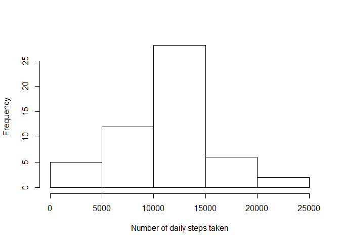
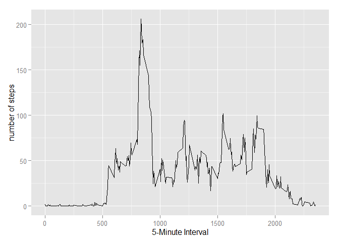
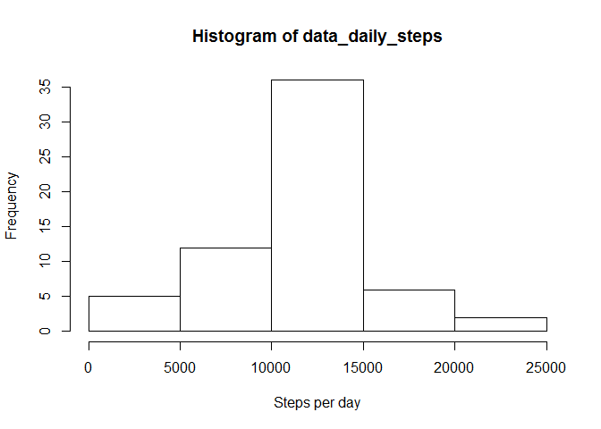
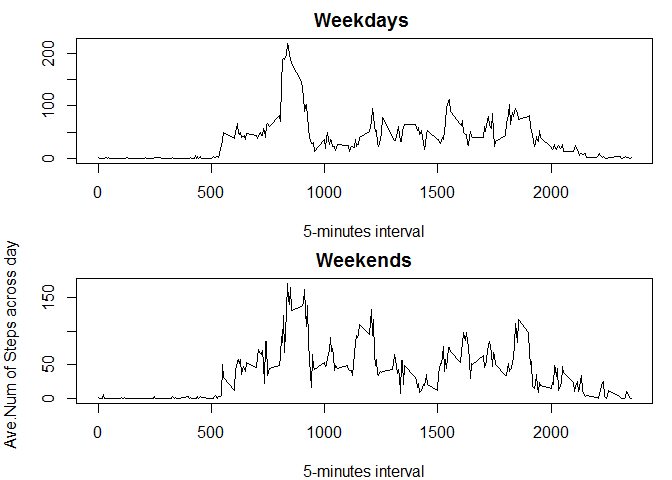

# Reproducible Research: Peer Assessment 1


## Loading and preprocessing the data

Show any code that is needed to

1. Load the data (i.e. read.csv())
2. Process/transform the data (if necessary) into a format suitable for your analysis

We first need to unzip the main file, then read it as csv into our dataset. Then we need to make sure the date column is in the right Date format (class):


```r
file_unzip <-unzip("activity.zip")
dataset_all<-read.csv(file_unzip, header=TRUE)
dataset_all$date <- as.Date(dataset_all$date) 
```
##What is mean total number of steps taken per day?

For this part of the assignment, you can ignore the missing values in the dataset.

1. Make a histogram of the total number of steps taken each day
2. Calculate and report the mean and median total number of steps taken per day

First we remove the "NA" values from the dataset, then aggregate the steps per day in order to develop a histogram of the toal number of steps taken each day. For the mean and median, we simply call the functions with the aggregated steps per-day data.


```r
dataset <- dataset_all[complete.cases(dataset_all[1]),]

# aggregate steps per day

steps_per_day <- data.frame(rowsum(dataset$steps, dataset$date) )
# add aggregated steps as a column
names(steps_per_day) <- ("steps") 
```

Plot histogram of the total number of steps taken each day:

```r
hist(steps_per_day$steps, xlab="Number of daily steps taken", main="")
```

 

The mean and median total number of steps are as follows:


```r
mean(steps_per_day$steps)
```

```
## [1] 10766.19
```

```r
median(steps_per_day$steps)
```

```
## [1] 10765
```


## What is the average daily activity pattern?
1. Make a time series plot (i.e. type = "l") of the 5-minute interval (x-axis) and the average number of steps taken, averaged across all days (y-axis)
2. Which 5-minute interval, on average across all the days in the dataset, contains the maximum number of steps?

We first convert the dataset to a average steps of 5-minute intervals per day. we use this using the plyr library.

```r
library(plyr)
# Calculate average steps for each of 5-minute interval during a 24-hour period
five_min_interval <- ddply(dataset,~interval, mean=round(mean(steps), 2), summarize)
```


Time series plot of the 5-minute interval (x-axis) and the average number of steps taken (averaged per day):


```r
library(ggplot2)
qplot(x=interval, y=mean, data = five_min_interval, xlab="5-Minute Interval", ylab="number of steps", geom = "line" )
```

 


Report the 5-min interval, on average across all the days in the dataset, contains the maximum number of steps:


```r
average_five_min_interval<-five_min_interval$mean
five_min_interval[which.max(average_five_min_interval),]
```

```
##     interval   mean
## 104      835 206.17
```


## Imputing missing values

Note that there are a number of days/intervals where there are missing values (coded as NA). The presence of missing days may introduce bias into some calculations or summaries of the data.

1. Calculate and report the total number of missing values in the dataset (i.e. the total number of rows with NAs)
2. Devise a strategy for filling in all of the missing values in the dataset. The strategy does not need to be sophisticated. For example, you could use the mean/median for that day, or the mean for that 5-minute interval, etc.
3. Create a new dataset that is equal to the original dataset but with the missing data filled in.
4. Make a histogram of the total number of steps taken each day and Calculate and report the mean and median total number of steps taken per day. Do these values differ from the estimates from the first part of the assignment? What is the impact of imputing missing data on the estimates of the total daily number of steps?


In total, there are 2304 missing values, as reported below:


```r
summary(dataset_all$steps)
```

```
##    Min. 1st Qu.  Median    Mean 3rd Qu.    Max.    NA's 
##    0.00    0.00    0.00   37.38   12.00  806.00    2304
```

My strategy was to imput the NAs with the average steps over the same 5-minute period. 


```r
five_min_pattern <- tapply(dataset$steps, dataset$interval, mean)
imputed_data <- dataset_all
for (i in 1:nrow(dataset_all)) {
      if(is.na(dataset_all$steps[i])){
            interation <- which(names(five_min_pattern) == dataset_all$interval[i])
            data_mean <- five_min_pattern[interation]
            imputed_data$steps[i] = data_mean
      }
}
names(imputed_data) <- c("steps", "date", "interval")
```

Used the new data, including the newly imputed missing values, to get the daily steps. This will be used to develop a histogram of the total number of steps over each day.


```r
data_daily_steps <- tapply(imputed_data$steps, imputed_data$date, sum)
hist(data_daily_steps, xlab = "Steps per day")
```

 

The mean number of steps per day is at 10766.19, considering the imputed data. The median is also at 10766.19. 


```r
mean(data_daily_steps)
```

```
## [1] 10766.19
```

```r
median(data_daily_steps)
```

```
## [1] 10766.19
```

```r
head(imputed_data)
```

```
##       steps       date interval
## 1 1.7169811 2012-10-01        0
## 2 0.3396226 2012-10-01        5
## 3 0.1320755 2012-10-01       10
## 4 0.1509434 2012-10-01       15
## 5 0.0754717 2012-10-01       20
## 6 2.0943396 2012-10-01       25
```

## Are there differences in activity patterns between weekdays and weekends?
For this part the weekdays() function may be of some help here. Use the dataset with the filled-in missing values for this part.

1. Create a new factor variable in the dataset with two levels - "weekday" and "weekend" indicating whether a given date is a weekday or weekend day.
2. Make a panel plot containing a time series plot (i.e. type = "l") of the 5-minute interval (x-axis) and the average number of steps taken, averaged across all weekday days or weekend days (y-axis). The plot should look something like the following, which was creating using simulated data:

To identify the weekdays from weekends, we need to create the proper date format using weekdays function. This way we could add the new factors as columns to the imputed data set.


```r
# create a new data type called weekday factor. we need to add a column (4th)to our new data set with converted date format "factor_wkday". we impute this column based on the day type (weekday or weekend)
factor_wkday <- weekdays(as.POSIXct(imputed_data$date))
# create an empty column and initialize the data type to character. It will be used for the day type.
imputed_data[,4] <- character()
# Loop through the dataset and imput the value of day type, weekday or weekend.
for (i in 1:length(factor_wkday)) {
      if (factor_wkday[i] == "Saturday" | factor_wkday[i] == "Sunday") {
            imputed_data[i,4] = "weekend"
      } else {
            imputed_data[i,4] = "weekday"
      }
}
# convert the day type column to a factor weekday or weekend
imputed_data[,4] <- as.factor(imputed_data[,4])
names(imputed_data) <- c("steps", "date", "interval", "dayType")
```

To distinguish different patterns we must create two separate datasets for weekends and weekdays. 


```r
weekdays <- subset(imputed_data, (imputed_data$dayType == "weekday"))
weekends <- subset(imputed_data, (imputed_data$dayType == "weekend"))

#  apply mean over subsets of a weekday and weekend patterns' vectors. 

weekday_pattern <- tapply(weekdays$steps, weekdays$interval, mean, simplify=TRUE)
weekend_pattern <- tapply(weekends$steps, weekends$interval, mean, simplify= TRUE)


par(mfrow = c(2,1), mar = c(4,4,2,1))

plot(as.numeric(dataset$interval[1:288]), weekday_pattern, xlab= "5-minutes interval", ylab = "",  main = "Weekdays ", type = 'l')
plot(as.numeric(dataset$interval[1:288]), weekend_pattern, xlab= "5-minutes interval", ylab = "Ave.Num of Steps across days", main = "Weekends",type = 'l')
```

 
